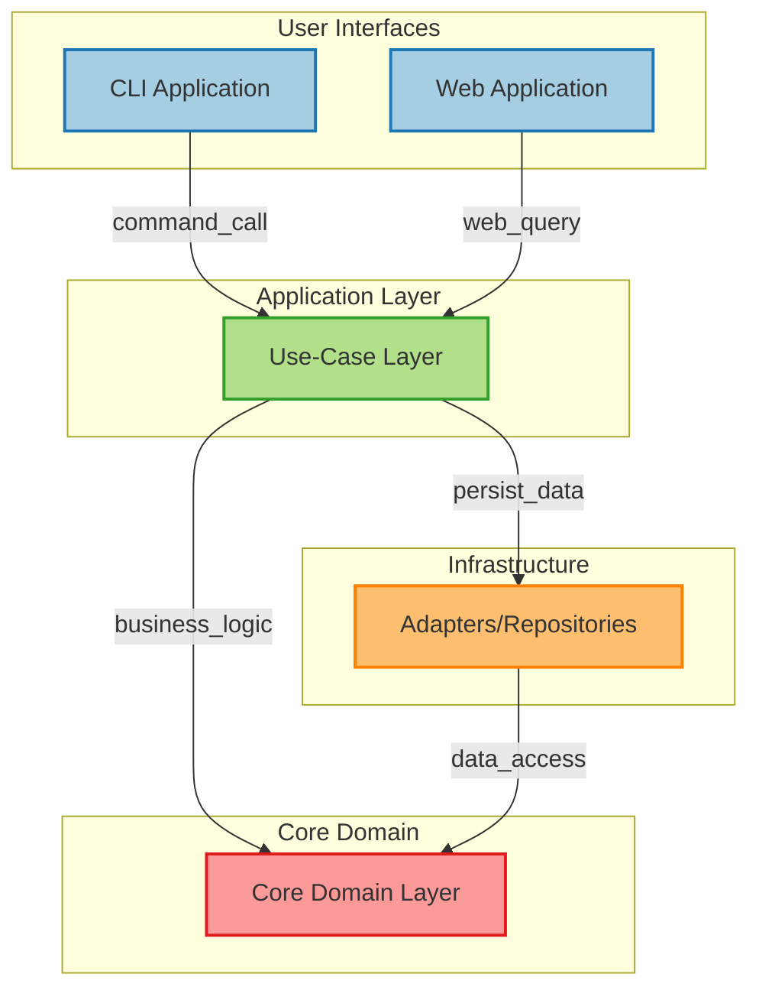
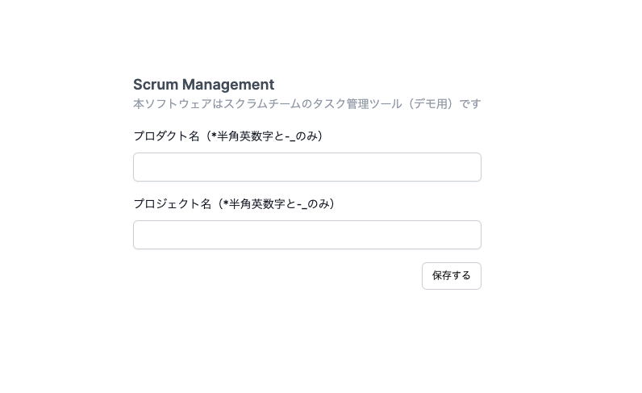

# scrum
このレポジトリは、スクラムのチームを管理するアプリケーションです。Web からも CLI からも動かせます。



## Quick Start
アプリケーションを動かす事前準備をします。

```
$ yarn install
$ yarn build
```

### CLI

CLI は `yarn scrum [command]` で動かせます。

```
$ cd apps/cli/
$ yarn scrum help
Usage: index [options] [command]

Options:
  -h, --help              display help for command

Commands:
  init                    最初の設定をします
  add-employee [options]  社員を追加します。 -m, --multiple 複数の社員を追加します
  edit-employee           社員の名前を変更します
  remove-employee         社員を削除します
  create-team             スクラムチームを作成します
  list-team               スクラムチームのメンバーを表示します
  edit-team [options]     スクラムチームのPOかSMを変更します。-po, --product-owner | -sm, --scrum-master
  disband-team            スクラムチームを解散します
  add-developer           スクラムチームの開発者を追加します
  remove-developer        スクラムチームから開発者を除外します
  help [command]          display help for command
```

DB を作成し、社員を追加してください。

```
$ yarn scrum init
最初の設定を開始します
? 開発するプロダクトの名前は？ sample
? プロジェクト名は？ sample-project
初期設定を完了しました
```

```
$ yarn scrum add-employee
? スクラムチームに参加する社員の名前は？（姓名は半角スペース区切り） foo bar
社員を登録しました: foo bar
```

社員を2名以上登録すると、`create-team` コマンドでスクラムチームを作成できます。

### Web

> [!NOTE]  
> `db.json`が root にあれば、このファイルを削除してください。
> 削除しなくても以下のコマンドは実行でき、アプリケーションも問題なく動作します。
> ただ、以下の説明は db.json がない状態を想定した説明になっていますのでご注意ください。

Next.js を開発者モードで動かします。

```
$ cd apps/web/
$ yarn next:dev
```

http://localhost:3000 にアクセスすると、以下の画面が表示されます。



プロジェクト名とプロダクト名を送信すると以下の画面に遷移します。


社員を2名以上登録して、サイドメニューのスクラムチームのページを見たり、遊んでみてください。
