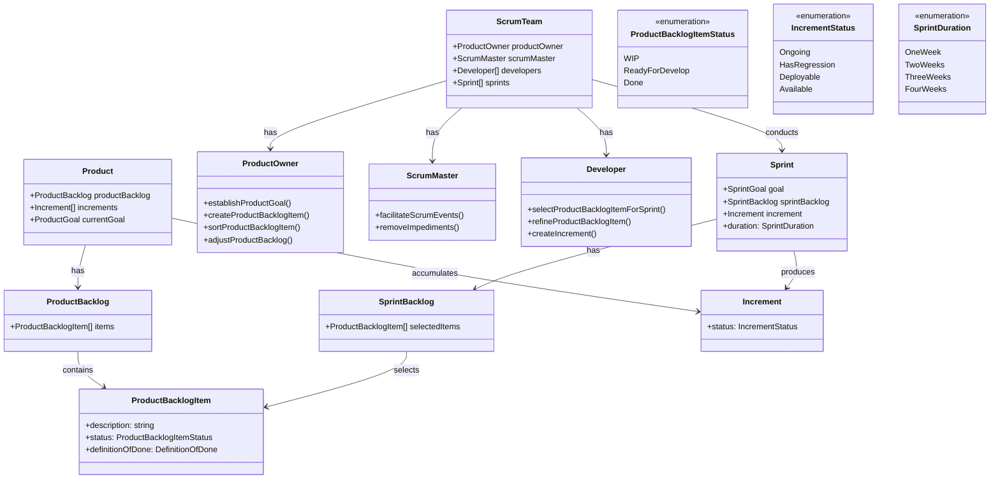

```mermaid
classDiagram

class ScrumTeam {
    +ProductOwner productOwner
    +ScrumMaster scrumMaster
    +Developer[] developers
    +Sprint[] sprints
}

class Product {
    +ProductBacklog productBacklog
    +Increment[] increments
    +ProductGoal currentGoal
}

class ProductBacklog {
    +ProductBacklogItem[] items
}

class ProductBacklogItem {
    +description: string
    +status: ProductBacklogItemStatus
    +definitionOfDone: DefinitionOfDone
}

class Sprint {
    +SprintGoal goal
    +SprintBacklog sprintBacklog
    +Increment increment
    +duration: SprintDuration
}

class SprintBacklog {
    +ProductBacklogItem[] selectedItems
}

class Increment {
    +status: IncrementStatus
}

class ProductOwner {
    +establishProductGoal()
    +createProductBacklogItem()
    +sortProductBacklogItem()
    +adjustProductBacklog()
}

class ScrumMaster {
    +facilitateScrumEvents()
    +removeImpediments()
}

class Developer {
    +selectProductBacklogItemForSprint()
    +refineProductBacklogItem()
    +createIncrement()
}

class ProductBacklogItemStatus {
    <<enumeration>>
    WIP
    ReadyForDevelop
    Done
}

class IncrementStatus {
    <<enumeration>>
    Ongoing
    HasRegression
    Deployable
    Available
}

class SprintDuration {
    <<enumeration>>
    OneWeek
    TwoWeeks
    ThreeWeeks
    FourWeeks
}

ScrumTeam --> ProductOwner : has
ScrumTeam --> ScrumMaster : has
ScrumTeam --> Developer : has
ScrumTeam --> Sprint : conducts
Product --> ProductBacklog : has
ProductBacklog --> ProductBacklogItem : contains
Sprint --> SprintBacklog : has
SprintBacklog --> ProductBacklogItem : selects
Sprint --> Increment : produces
Product --> Increment : accumulates
```
