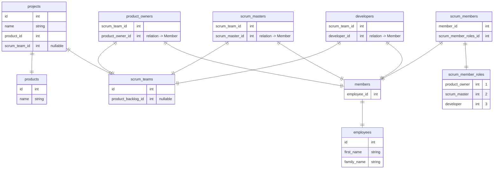

```mermaid
%% https://qiita.com/ramuneru/items/32fbf3032b625f71b69d
%% 関係性は今は適当に書いてる

erDiagram
    products {
        id int
        name string
    }

    projects {
        id int
        name string

        product_id int
        scrum_team_id int "nullable"
    }
    projects ||--|| products: ""
    projects ||--|| scrum_teams: ""

    employees {
        id int
        first_name string
        family_name string
    }

    members {
        employee_id int
        %% department id
    }
    members ||--|| employees: ""

    scrum_member_roles {
        product_owner int "1"
        scrum_master int "2"
        developer int "3"
    }

    scrum_members {
        member_id int
        scrum_member_roles_id int
    }
    scrum_members ||--|| members: ""
    scrum_members ||--|| scrum_member_roles: ""

    scrum_teams {
        id int

        product_backlog_id int "nullable"
    }

    product_owners {
        scrum_team_id int
        product_owner_id int "relation -> Member"
    }
    product_owners ||--|| scrum_teams : ""
    product_owners ||--|| members : ""

    scrum_masters {
        scrum_team_id int
        scrum_master_id int "relation -> Member"
    }
    scrum_masters ||--|| scrum_teams : ""
    scrum_masters ||--|| members : ""

    developers {
        scrum_team_id int
        developer_id int "relation -> Member"
    }
    developers ||--|| scrum_teams : ""
    developers ||--|| members : ""

```
