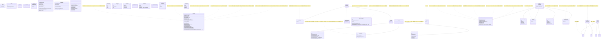

```mermaid
classDiagram
    class Project {
        +int productId
        +int scrumTeamId
    }

    class Product {
        +int id

        +IncrementSummary incrementSummary
        +ProductBacklog productBacklog
        +ProductGoal[] goals
    }

    class Employee {
        +string name
    }

    class Department {
        +Employee[] members
    }

    class ScrumMemberRole {
        <<enumeration>>
        ProductOwner
        ScrumMaster
        Developer
    }

    class ScrumTeam {
        %% ProductOwner とか ScrumMaster は ID 参照の方がいいかもしれないと思ったけど、
        %% あえて集約を持つ実装にしてみる。いつもやっていないことをやってみるため
        +ProductOwner productOwner
        +ScrumMaster scrumMaster
        +Developer[] developers

        +getCurrentSprintId() string
        +getLastSprintId() string

        +formTeam()
        +addTeamMember(Member member) this
        +removeTeamMember(Member member) void
        +disband() %% 解散する
        +inspectIncrementResult()

        +startSprint()
        +defineSprintGoal()
        +adjustProductBacklog()
        +refineProductBacklogItem()
        +demonstrateIncrementsToStakeholders()
        +inspectProgressOfLastSprint()
        +discussGoodAndBadOfLastSprint()
        +doneSprintBacklogItem() Increments

        +inviteOtherTeamMembers(Member[] members)

        +makeIncrementHasRegression(int IncrementId)
        +releaseProductBacklogItem(ProductBacklogItem item) void
        +moveProductBacklogItemInSprintBacklogToProductBacklog(ProductBacklogItem item) void
        %% check if items of the sprint meet definition of done
    }
    note for ScrumTeam "スクラムチームは、\n・スクラムマスター1⼈\n・プロダクトオーナー1⼈\n・8⼈以下の開発者\nで構成される"
    note for ScrumTeam "スプリントゴールは、\nスプリントプランニング中に\n作成する必要がある"
    note for ScrumTeam "スプリントプランニング中に\nプロダクトバックログアイテムの\nリファインメントができる"
    note for ScrumTeam "レトロスペクティブ中に\n次のスプリントの\nバックログにアイテムを追加できる"
    note for ScrumTeam "インクリメントの完成の定義は、\n組織のものを使う。\n組織のものがなければ、プロダクトに適した完了の定義を作成する"
    note for ScrumTeam "プロダクトバックログアイテムが完成の定義を満たしていない場 合、リリースすることはできない。ましてやスプリントレビューで提⽰することもできない。"

    class ProductOwner {
        -ScrumMemberRole[] roles
        -Employee employee

        +establishProductGoal()
        +createProductBacklogItem()
        +sortProductBacklogItem()
        +adjustProductBacklog()

        +adjustScopeOfSprintBacklog()
        +abortSprint()
        +respondToScopeAdjustmentRequestFromDevelopersInSprint()
        +supportDevelopers(e.g., discussion, providing information)

        +participateInScrumTeamAsDeveloper()
        +canDevelop() boolean
    }

    class ScrumMaster {
        -ScrumMemberRole[] roles
        -Employee employee

        +coachTeamMembers()
        +createProductBacklogItem()
        +ensureAllScrumEventsAreHeldAndTimeboxesAreRespected()
        +facilitateCollaborationWithStakeholders()
        +participateInScrumTeamAsDeveloper()
        +removeIImpediments()
    }

    class Developer {
        -ScrumMemberRole role
        -Employee employee

        +selectProductBacklogItemForSprint()
        +refineProductBacklogItem()
        +planWorkForSprintBacklogItem()
        +evaluateWorkScaleOfProductBacklogItem()

        +createSprintBacklog()
        +adjustSprintBacklog()
        +proceedWithSprintBacklogItem()

        +adaptDailyPlanForSprintGoal()
        +createIncrement()
        +inspectIncrement()
        +createSprintGoal()
    }

    class Commitment {
        <<interface>>
    }

    class ProductGoalStatus {
        <<enumeration>>
        WIP
        Ongoing
        Done
        Aborted
    }

    Commitment <|-- ProductGoal
    class ProductGoal {
        +string goal
        +ProductGoalStatus status
    }
    note for ProductGoal "次の⽬標に移る前に、スクラムチームはひとつのProductGoalを達成（または放棄）しなければならない。"

    class Artifact {
        <<interface>>
        +getCommitments() Commitment[]
    }
    note for Artifact "各作成物には、透明性と集中を⾼める情報を提供する「確約（コミットメント）」が含まれている"

    class ProductBacklogItemStatus {
        <<enumeration>>
        WIP
        NeedForHelpOfProductOwner
        ReadyForDevelop
        Done
    }

    Commitment <|-- DefinitionOfDone
    class DefinitionOfDone {
        +string definition
    }

    class ProductBacklogItem {
        +int id
        +ProductBacklogItemStatus status
        +DefinitionOfDone definitionOfDone
        +string title
        +string description

        +canBeMovedToSprintBacklog() boolean
        +hasMetDefinitionOfDone() boolean %% status が done かどうかチェックすれば良い
        +meetsDefinitionOfDone() Increment[]
    }
    note for ProductBacklogItem "status が ReadyForDevelop, Doneのものはスプリントバックログに移せる"
    note for ProductBacklogItem "プロダクトバックログアイテムが完成の定義を満たしたときにインクリメントが誕⽣する"

    class ProductBacklogItemSortOption {
        <<enumeration>>
        AscByPriority
        DescByPriority
        AscByCreated
        DescByCreated
    }

    Artifact <|-- ProductBacklog
    class ProductBacklog {
        +int id
        +ProductBacklogItem[] items

        +add(ProductBacklogItem item): this
        +remove(ProductBacklogItem item): this
        +getProductBacklogItems(): ProductBacklogItem[]
        +getProductBacklogItem(int id): ProductBacklogItem
        +sort(ProductBacklogItemSortOption option): this:
    }

    Commitment <|-- SprintGoal
    class SprintGoal {
        +string goal
    }

    class SprintBacklogItem {
        +Date created
    }

    Artifact <|-- SprintBacklog
    class SprintBacklog {
        +int id
        +SprintBacklogItem[] items

        +addItem(Implementable item) this
        +getItems() SprintBacklogItem[]
    }
    note for SprintBacklog "ProductGoalは、1つしか選べない。「他に着手中のProductGoalがあれば、ProductBacklog に設定できない」というルールはSprintBacklogのvalidateかドメインサービスで実装すると良い？"

    class IncrementStatus {
        <<enumeration>>
        Ongoing
        HasRegression
        Deployable
        Available %% デプロイ後、Availableになる
    }

    Artifact <|-- Increment
    class Increment {
        +int id
        +int ProductBacklogId
        +IncrementStatus status

        +canDeploy() boolean
        +setDeployable() this
        +setAvailable() this
        +setHasRegression() this
    }
    note for Increment "プロダクトバックログアイテムが完成の定義を満たしたときにインクリメントが誕⽣する。"

    class IncrementSummary {
        +int[] incrementIds
    }

    class UserStory {
        <<Abstract>>
    }

    UserStory <-- Epic
    class Epic {

    }

    UserStory <-- Feature
    class Feature {

    }

    class Implementable {
        <<interface>>
    }
    note for Implementable "Developer が、実装可能できる（スプリント内で実装可能、また仕様面で詳細化されていることを示す）"

    UserStory <-- Story
    Implementable <|-- Story
    class Story {

    }
    note for Story "2日以内に終わる"

    Implementable <|-- Task
    class Task {

    }
    note for Task "4時間以内に終わる"

    class ScrumEventType {
        <<enumeration>>
        Sprint
        SprintPlanning
        DailyScrum
        SprintReview
        SprintRetrospective
    }

    class ScrumEvent {
        <<interface>>
        +getType() ScrumEventType
        +getStartTime() Date
        +getEndTime() Date
    }

    class SprintTimeBox {
        <<enumeration>>
        OneWeek
        TwoWeeks
        ThreeWeeks
        FourWeeks
    }

    class Duration {
        +Date start
        +Date end
    }
    note for Duration "start < end"

    %% スクラムイベントは、時間によって進むステータスなのかもしれない。
    %% 例えば「この時間はxを開催中」とか
    ScrumEvent <|-- Sprint
    class Sprint {
        +sprintPlanningId sprintPlanning
        +dailyScrumId[] dailyScrums
        +sprintReviewId sprintReview
        +sprintRetrospectiveId sprintRetrospective
        +sprintBacklogId sprintBacklogId

        +SprintGoal[] sprintGoals
        +Increment[] increments

        +SprintTimeBox sprintTimeBox
        +Duration duration %% こちらは duration がいいかもしれない
    }
    note for Sprint "スプリントが中止された時は、TimeBox の終わりの時間を中止した時間にする"
    note for Sprint "TimeBox は SprintTimeBox の期間以下である（中止のケースに備える）"
    note for Sprint "次の⽬標に移る前に、スクラムチームはひとつのProductGoalを達成（または放棄）しなければならない。"

    ScrumEvent <|-- SprintPlanning
    class SprintPlanning {
        +int id
        +string place
        +TimeBox timeBox
        +Duration duration
        +string[] sprintGoals
    }
    note for Sprint "スプリントゴールは、スプリントプランニングの終了までに確定する必要がある"
    note for Sprint "スプリントが 1 か⽉の場合、スプリントプランニングのタイムボックスは最⼤で 8 時間である"

    ScrumEvent <|-- DailyScrum
    class DailyScrum {
        +int id
        +string place
        +TimeBox timeBox
        +Duration duration
    }
    note for DailyScrum "デイリースクラムの長さは15分である"

    ScrumEvent <|-- SprintReview
    class SprintReview {
        +int id
        +string place
        +TimeBox timeBox
        +Duration duration

        +Employee[] stakeholders
    }
    note for SprintReview "スプリントが1か⽉の場合、タイムボックスは最⼤4時間である"

    ScrumEvent <|-- SprintRetrospective
    class SprintRetrospective {
        +int id
        +string place
        +TimeBox timeBox
        +Duration duration
    }
    note for SprintRetrospective "スプリントが1か⽉の場合、 スプリントレトロスペクティブは最⼤3時間である"
```
